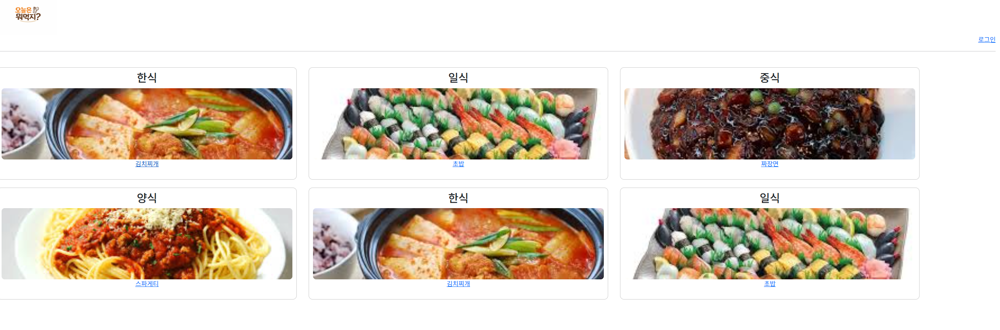
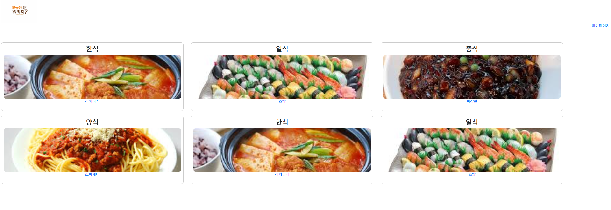
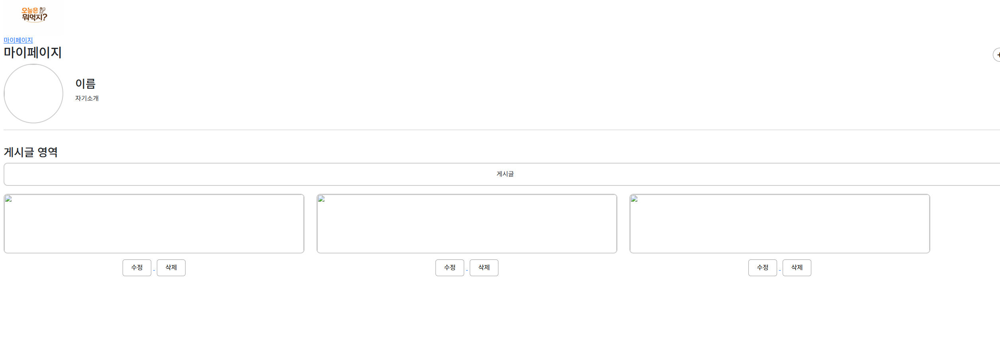

# 오늘 뭐 먹지 (What Do I Eat Today)

레시피를 공유하는 사이트입니다.

## README 작업 진행 상태

- [x] Project Overview
- [x] Project Info
- [x] Features
- [x] Tech Stack
- [x] Architecture
- [x] Authentication Flow
- [x] Image Storage
- [x] Getting Started
- [x] Technical Decisions

## Project Overview

`오늘 뭐 먹지`는 단순히 레시피 사이트를 만드는 것보다, 직접 구현해보고 싶었던 기능을 실습해보기 위해 시작한 프로젝트입니다.

이 프로젝트에서 먼저 두고 싶었던 기술적 목표는 아래 두 가지였습니다.

- 이미지 데이터를 저장하고 다루는 흐름 설계
- JWT 기반 로그인과 쿠키 인증 처리 구현

이 목표를 자연스럽게 담아낼 수 있는 주제로 레시피 공유 서비스를 선택했고, 그 과정에서 화면 구조 설계와 서버 렌더링 방식까지 함께 경험하는 것을 목표로 했습니다.

주요 학습 키워드는 다음과 같습니다.

- WireFrame
- SSR
- JWT
- Cookie
- 외부 스토리지(S3)

## Project Info

| 항목 | 내용 |
| --- | --- |
| 프로젝트명 | 오늘 뭐 먹지 (What Do I Eat Today) |
| 개발 기간 | 2026.03.03 ~ 2026.03.05 (3일) |
| 개발 인원 | 3명 |
| 한 줄 설명 | 레시피를 공유하는 사이트 |

### 팀 구성

| 이름 | 역할 | 담당 내용 |
| --- | --- | --- |
| 김석제 | 종합 | HTML, DB, AWS EC2, AWS S3, JWT 로그인 로직 작성, 쿠키 발급 |
| 박승현 | 프론트엔드 | HTML, CSS, JavaScript, Bootstrap |
| 김상현 | 백엔드 | HTML, JavaScript, Bootstrap, 로그인 로직 작성 |

## Features

### 구현된 기능

- 레시피 조회
- 레시피 선택 및 상세 확인
- 로그인
- 로그인 후 마이페이지 접근

### 미구현 기능

- 로컬 이미지 선택 후 업로드
- 레시피 종목별 조회
  - 한식
  - 양식
  - 중식
  - 일식

## 화면 미리보기

README에 사용하는 이미지 자산은 서비스 실행용 `static` 폴더와 분리해 `docs/images`에 정리했습니다.

| 화면 | 파일 |
| --- | --- |
| 메인 화면 | `docs/images/main-page.png` |
| 로그인 화면 | `docs/images/login-page.png` |
| 로그인 후 메인 화면 | `docs/images/main-after-login.png` |
| 마이페이지 | `docs/images/mypage.png` |

### 1. 메인 화면

메인 화면에서는 레시피 목록을 카드 형태로 확인할 수 있습니다.



### 2. 로그인 화면

로그인 화면에서는 ID와 비밀번호를 입력해 인증을 요청할 수 있습니다.


### 3. 로그인 후 메인 화면

로그인에 성공하면 상단 메뉴에서 마이페이지로 이동할 수 있는 상태가 표시됩니다.



### 4. 마이페이지

마이페이지에서는 사용자 정보와 게시글 영역을 확인할 수 있습니다.



## Tech Stack

| 카테고리 | 기술 |
| --- | --- |
| Frontend | HTML5, CSS3, JavaScript, Bootstrap |
| Template Engine | Jinja2 |
| Database | MongoDB |
| Authentication | JWT |
| Infrastructure / Deployment | AWS EC2, AWS S3 |

## Architecture

아키텍처 이미지는 별도로 정리되어 있으며, 서비스 구조는 아래 흐름을 기준으로 이해할 수 있습니다.

- 소스 코드는 GitHub / Git으로 관리합니다.
- 배포 시에는 FileZilla를 통해 AWS EC2 서버로 프로젝트 파일을 전달합니다.
- EC2 환경에서 Flask 서버를 실행하고, 서버 내부에서 Python, Jinja, JWT 기반 인증 로직을 사용합니다.
- Flask 서버는 데이터 저장을 위해 MongoDB를 사용하고, 이미지 저장소로는 AWS S3를 사용하는 방향으로 구성했습니다.
- 즉, MongoDB와 S3가 직접 연결되는 구조가 아니라 Flask 서버가 각 서비스를 각각 사용하도록 설계한 형태입니다.

## Authentication Flow

현재 로그인 흐름은 Flask 서버와 쿠키 기반 JWT 인증을 중심으로 구성되어 있습니다.

| 단계 | 설명 |
| --- | --- |
| 1 | 사용자가 로그인 요청을 보내면 Flask 서버가 입력한 계정 정보를 DB의 사용자 정보와 비교합니다. |
| 2 | 인증에 성공하면 `PyJWT` 라이브러리로 JWT를 생성합니다. |
| 3 | 생성된 JWT를 `HttpOnly` 쿠키로 발급합니다. |
| 4 | 브라우저는 이후 요청마다 해당 쿠키를 자동으로 전송합니다. |
| 5 | 서버는 로그인 페이지를 제외한 화면 렌더링 과정에서 쿠키의 JWT를 확인하고, `jwt.decode()`를 통해 JWT 서명 검증을 수행합니다. |
| 6 | 검증에 성공하면 로그인 상태로 판단하고, 마이페이지처럼 인증 상태를 전제로 하는 화면 접근에 활용합니다. |

현재 코드 기준으로는 `PyJWT`를 사용해 JWT 서명 검증을 수행하고 있으며, 만료 토큰 예외 처리 코드도 포함되어 있습니다. 다만 발급 payload에는 아직 `exp` 값이 포함되어 있지 않아, 만료 시간 검사는 추후 보완이 필요한 상태입니다.

## Image Storage

이 영역은 아직 구현이 완료되지 않았습니다.

- 현재 이미지 업로드 기능은 구현 예정입니다.
- 향후에는 사용자가 업로드한 이미지를 AWS S3에 저장하고,
- MongoDB에는 이미지 URL 또는 관련 메타데이터를 저장하는 구조로 확장할 계획입니다.

즉, 현재 저장소에는 이미지 처리 방향과 인프라 선택 의도는 반영되어 있지만, 실제 업로드 기능까지 완료된 상태는 아닙니다.

## Getting Started

배포 환경은 AWS EC2 / S3를 기준으로 구성했지만, 비용과 실행 환경 차이를 고려해 README에서는 로컬 실행 기준으로 안내합니다.

### 실행 순서

1. 레포지토리 클론
2. 가상환경 생성
3. 가상환경 활성화
4. 의존성 설치
5. 서버 실행
6. 브라우저 접속

### 1) 레포지토리 클론

```bash
git clone https://github.com/hwarang97/recipe-site.git
cd recipe-site
```

### 2) 가상환경 생성

```bash
python -m venv .venv
```

### 3) 가상환경 활성화

Windows

```bash
.venv\Scripts\activate
```

Mac / Linux

```bash
source .venv/bin/activate
```

### 4) 의존성 설치

```bash
pip install -r requirements.txt
```

### 5) 서버 실행

```bash
python app.py
```

### 6) 브라우저 접속

아래 주소 중 하나로 접속하면 됩니다.

```text
http://localhost:5000
http://127.0.0.1:5000
```

## Technical Decisions

이 섹션은 추후 보완 예정이며, 현재는 핵심 방향만 간단히 정리했습니다.

| 주제 | 메모 |
| --- | --- |
| JWT + Cookie 인증 방식 | 로그인 이후 브라우저가 자동으로 인증 정보를 전송할 수 있도록 쿠키 기반 흐름을 선택했습니다. |
| SSR(Jinja) 사용 | Flask와 함께 서버 렌더링 방식으로 화면을 구성하며 템플릿 기반 페이지 전환을 구현했습니다. |
| 외부 스토리지(S3) 분리 방향 | 이미지 파일은 애플리케이션 서버와 분리된 저장소에서 관리하는 구조를 목표로 두었습니다. |
